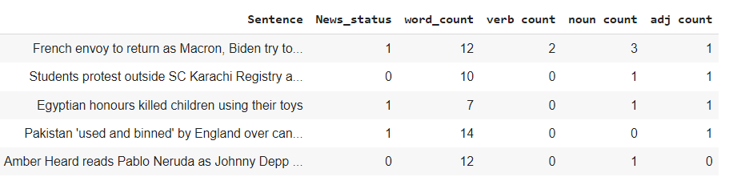

# NLTK - Natural Language Toolkit

NLTK is a comprehensive Python library for natural language processing tasks. It provides a wide range of tools and resources for processing, analyzing, and understanding human language data.

## Features

- Tokenization: Splitting text into individual words or sentences.
- Stemming: Reducing words to their base or root form.
- Part-of-speech Tagging: Assigning grammatical tags to words.
- Named Entity Recognition: Identifying and classifying named entities in text.
- Sentiment Analysis: Determining the sentiment or opinion expressed in text.
- Text Classification: Categorizing text into predefined classes or categories.
- Language Corpora: Extensive collection of language data for training and testing models.
- Lexical Resources: Dictionaries, thesauri, and word lists for language analysis.

## Getting Started

Follow these instructions to get started with NLTK:

1. Install NLTK using pip: `pip install nltk`
2. Download NLTK data: `python -m nltk.downloader all`
3. Import NLTK in your Python script or interactive session: `import nltk`

Refer to the NLTK documentation for detailed guides, tutorials, and examples.

## Contributing

Contributions to NLTK are welcome! If you want to contribute to the project, please follow the guidelines outlined in the CONTRIBUTING.md file.

## License

NLTK is released under the Apache License 2.0. Please refer to the LICENSE file for more details.

## Community and Support

Join the NLTK community to ask questions, share ideas, and get support. Here are some helpful resources:

- NLTK Website: https://www.nltk.org
- NLTK Mailing List: https://groups.google.com/group/nltk-users
- NLTK GitHub Repository: https://github.com/nltk/nltk

## Acknowledgements

NLTK is developed and maintained by a team of contributors. We would like to thank all the individuals and organizations that have contributed to the project.

# News sentiment analysis with NLTK

